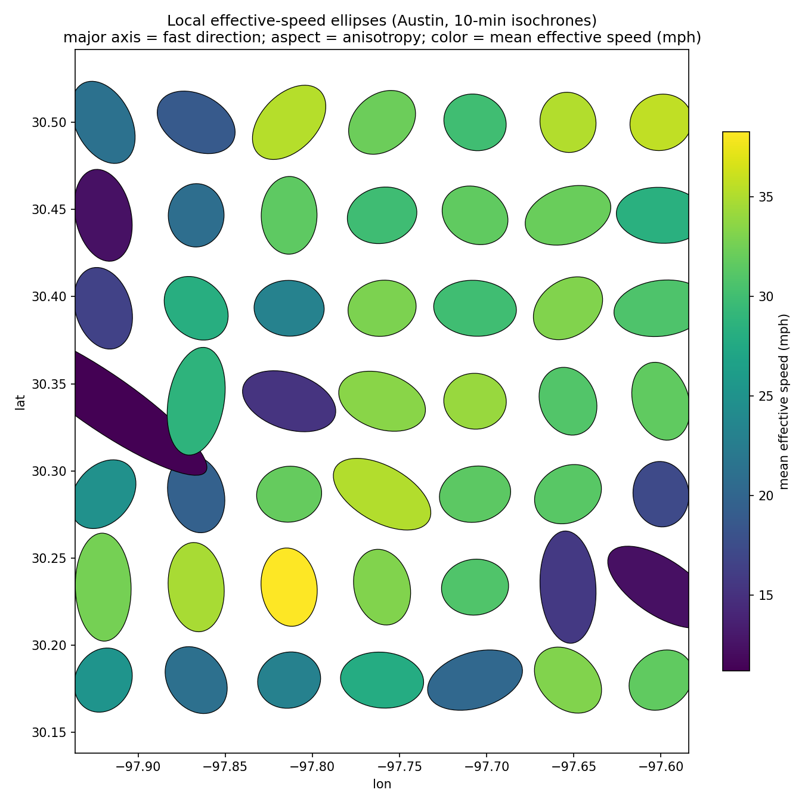

# isochrone-metric

How much — and *where* — does getting around a city diverge from straight-line distance?

Every point in a city has a 10-minute drive isochrone around it. It's not a circle: it's stretched along highways, pinched by rivers, sliced by one-way grids, dilated by hills. We treat that shape as data. At each origin, we fit an **ellipse to the isochrone** and read off (a) the effective speed in each direction and (b) how anisotropic the network is at that point. Sweep across a grid and you get two fields over the city — an effective-speed map and an anisotropy map — plus a single L^p number summarizing how non-Euclidean the network is overall.

The point: get from "isochrone maps look cool" to a quantitative description of urban form that's directly comparable across cities, modes, and time.

## What this is good for

Things this lets us measure or argue about:

- **Where the network bends space**: corridor effects of major highways, river crossings, transit deserts; neighborhoods that are "close on a map but far in time."
- **Network non-isotropy as a scalar**: a single L^p number summarizing how much a city's effective metric deviates from Euclidean. Comparable across cities and over time.
- **Pre/post**: rerun after a road diet, a new highway, a transit line opening; the difference field is the effect.
- **Multimodal**: same pipeline against drive vs. transit vs. bike isochrones — anisotropy of *each*, plus the gap between them.

First study region: **Austin, TX**. Routing backend: **local Valhalla** in Docker on an OSM extract. Local because we want unlimited isochrones without rate limits or per-call cost.

## Read these next

- [AGENTS.md](AGENTS.md) — repo conventions, how to work here (read first; agentic tools should too).
- [docs/math.md](docs/math.md) — the ellipse fit, L^p aggregation, what's fragile.
- [docs/journal.md](docs/journal.md) — running session log.
- [docs/decisions/](docs/decisions/) — short ADRs for non-obvious choices.
- [CONTRIBUTING.md](CONTRIBUTING.md) — branch / commit / PR conventions.

## Setup

```sh
uv sync
cp .env.example .env
./scripts/fetch_extract.sh   # downloads the Austin OSM extract
docker compose up -d         # first start builds Valhalla tiles (a few minutes)
```

Then `http://localhost:8002/isochrone` is the routing endpoint. See `src/isochrone_metric/routing.py` for the Python wrapper, `src/isochrone_metric/tensor.py` for the per-point ellipse fit.

## A first look at Austin

Run the pipeline end-to-end:

```sh
uv run python scripts/run_austin_grid.py --n 7 --minutes 10
uv run python scripts/plot_grid.py data/results/austin_7x7_10min.jsonl
```

49 origins on a 7×7 grid over central Austin, 10-minute drive isochrones, ellipse fit at each. Sample output (figures committed to `docs/figures/`):



The dot at each origin becomes an ellipse: aspect = anisotropy, major axis = fast direction, color = mean effective speed (mph). Over central Austin: median effective speed ~31 mph, median anisotropy ratio ~1.4, max ~4.5 (one origin where the slow axis is nearly 5× the fast axis — a corridor effect). End-to-end: ~1.5s for all 49 fits against the local Valhalla.
